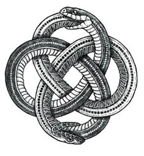

# ♾️ Ouroboros Loop Station
DIY 5-Track Audio Looper

Ouroboros is a DIY 5-track (Layers) stereo loop station designed for musicians, producers, and synth enthusiasts.
Built on the Electrosmith Daisy Seed platform, it offers real-time looping with zero menu diving — just buttons and knobs.

## Key Features

- **5 independent stereo tracks** (33 seconds each at 48kHz)
- **Real-time per-track control**:
  - Speed: 0.3× to 2.0×
  - Pan: Left/Right positioning  
  - Volume: Individual + Master
- **Multi-input support**: Guitar, Mic, Line
- **Instant control** — no menus, just hold button + turn knob

## Audio I/O

- 🎸 **Guitar** (Hi-Z)
- 🎤 **Microphone** (with analog preamp)
- 🎧 **Stereo Line In**
- 🔊 **Stereo Output**

## Hardware

- **Daisy Seed** (STM32H750 microcontroller)
- **Through-hole components** only — easy to solder and mod
- **DIY-friendly design**

### Schematic & PCB Files

- **Schematic**: [PDF](Hardware/Schematic/Schematic_Ouroboros-Loop-Station-rev.0.7_2025-08-07.pdf) | [EasyEDA JSON](Hardware/Schematic/SCH_Ouroboros-Loop-Station-rev.0.7_2025-08-07.json)
- **PCB**: Work in progress
- **BOM**: Coming soon

## How to Use

### Recording a Track
1. **Select layer** - Press any layer button (1-5)
2. **Choose input** - Press channel button to cycle: Guitar → Mic → Line
3. **Record** - Hold record button to start recording
4. **Stop** - Release record button to stop and start playback

### Playback Control  
- **Play/Pause** - Single click record button
- **Clear track** - Double click record button
- **Volume** - Turn individual layer volume knob
- **Master volume** - Turn master volume knob

### Real-time Effects
- **Speed control** - Hold any layer button + turn speed knob
- **Pan control** - Hold any layer button + turn pan knob

## Status
Firmware is read and tested
Schematic is ready and tested
PCB - WIP
