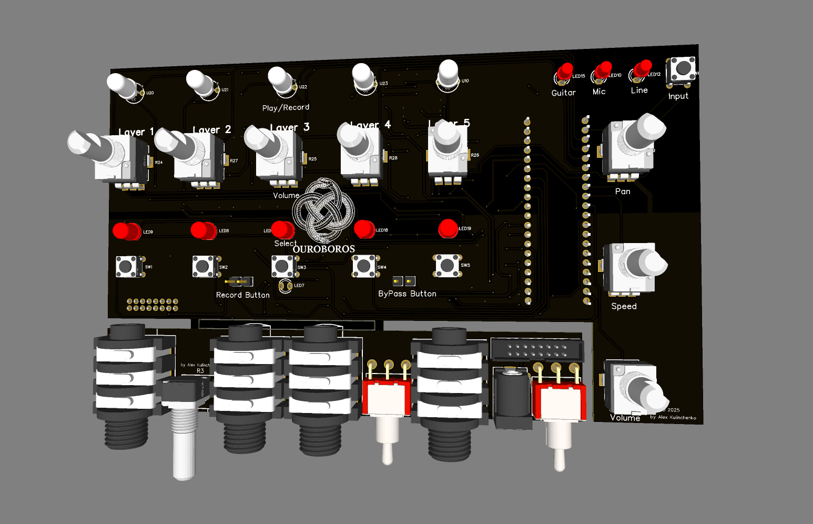

# ♾️ Ouroboros Loop Station
DIY 5-Track Audio Looper


Ouroboros is a DIY 5-track (Layers) stereo loop station designed for musicians, producers, and synth enthusiasts.
Built on the Electrosmith Daisy Seed platform, it offers real-time looping with zero menu diving — just buttons and knobs.


## Key Features

- **5 independent stereo tracks** (33 seconds each at 48kHz)
- **Real-time per-track control**:
  - Speed: 0.3× to 2.0×
  - Pan: Left/Right positioning  
  - Volume: Individual + Master
- **Multi-input support**: Guitar, Mic, Line
- **Instant control** — no menus, just hold button + turn knob

## Audio I/O

- 🎸 **Guitar** (Hi-Z)
- 🎤 **Microphone** (with analog preamp)
- 🎧 **Stereo Line In**
- 🔊 **Stereo Output**

## Hardware

- **Daisy Seed** (STM32H750 microcontroller)
- **Through-hole components** only — easy to solder and mod
- **DIY-friendly design**

**Front Side:**


**Back Side:**


## Hardware
It’s free to use. If you build one and fancy buying me a pint, you can do so here:

[Paypal](https://www.paypal.com/paypalme/AlexKulinchenko)

[Ko-fi.com](https://ko-fi.com/alex_kulinchenko)

Links

* **Schematic**: [PDF](Hardware/Ouroboros%20Schematic%20v1.1-1.2.pdf)
* **PCB v1.1 (Tested)**: [Gerber Files](Hardware/PCB%201.1/PCB_Gerber_1.1.zip)
* **PCB v1.2 (Beta)**: [Gerber Files](Hardware/PCB%201.2/PCB_Gerber_1.2.zip)
* **BOM**: [Excel File](Hardware/BOM_Ouroboros_rev.1.xlsx)
* **3D-printable enclosure**: [3D Files](Hardware/3d%20Printing%20Box%201.1/)
* **Front Panel**: [Design Files](Hardware/Front%20Panel%201.1-1.2/)

## Firmware

Ready-to-flash firmware is available in the `Firmware Master/` folder.

### Flashing Instructions

**Option 1: USB Mass Storage (Easiest)**
1. Download the `.bin` file from [Firmware Master](Firmware%20Master/)
2. Put Daisy Seed in USB Mass Storage mode:
   - Hold **BOOT** button
   - While holding BOOT, press and release **RESET** 
   - Release **BOOT** button
3. Daisy appears as USB drive on your computer
4. Drag and drop the `.bin` file to the USB drive
5. Firmware flashes automatically and Daisy restarts

**Option 2: DFU Flashing**
```bash
make program-dfu
```

**Building from Source**
```bash
make
# Creates main.bin in build/ folder
```

---

Release notes v1.1 (important)

* IDC 16-pin ribbon. I planned to use a standard IDC ribbon to simplify assembly, but I mistakenly used a 1.27 mm pitch instead of 2.54 mm. You’ll either need a matching cable or to hand-wire the connection.
* The output is stereo. Always use a stereo (TRS) jack — a mono plug will short one side of the op-amp. I’ve added protection, but it’s still best to use TRS.
* Analogue and digital grounds are separated and tied at a single point. You must bridge them under the Daisy Seed before power-up. I left this open for easier debugging.
* This PCB does not fit standard Hammond aluminium boxes as-is. Potentially, you can abandon PCB for a socket and fit it with just wires. A 3D-printable enclosure is included.

---

In progress — v1.2 (draft)

I’ve reworked the socket I/O board and corrected the IDC footprint. It should fit a larger Hammond enclosure. If anyone is willing to test the new PCB, you’re very welcome.

* **V1.2 files**: [PCB Gerber Files](Hardware/PCB%201.2/PCB_Gerber_1.2.zip)
* Notes:
  * Socket / I-O board fully redesigned (new layout, different switch/jack footprints).
  * IDC 16-pin footprint corrected; please confirm the pitch before fabrication.


When time allows (between work and family), I plan to design a single-board version combining the Daisy and I/O section, properly sized for a Hammond enclosure.

Feel free to ask questions – always happy to help.


## How to Use

### Recording a Track
1. **Select layer** - Press any layer button (1-5)
2. **Choose input** - Press channel button to cycle: Guitar → Mic → Line
3. **Record** - Hold record button to start recording
4. **Stop** - Release record button to stop and start playback

### Playback Control  
- **Play/Pause** - Single click record button
- **Clear track** - Double click record button
- **Volume** - Turn individual layer volume knob
- **Master volume** - Turn master volume knob

### Real-time Effects
- **Speed control** - Hold any layer button + turn speed knob
- **Pan control** - Hold any layer button + turn pan knob

